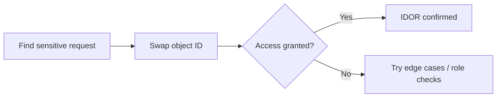

# IDOR — Insecure Direct Object Reference (testing notes)

IDOR is when you can access or modify an object **just by guessing or changing its identifier**, because authorization checks are missing or inconsistent.

Think: “If I change `user_id=123` to `user_id=124`, do I see someone else’s data?”

## Practical setup

- Create **two accounts** (or two roles) in the same app:
  - attacker account
  - victim account

## Where IDOR shows up

- REST resources: `/users/{id}`, `/orders/{id}`, `/files/{id}`
- Query params: `?id=...`, `?account=...`
- JSON bodies: `{ "userId": ... }`
- GraphQL IDs in variables
- Exports: invoices, reports, “download file” endpoints

## Verification checklist

1. Identify a request that reads or updates a sensitive object.
2. Change only the identifier.
3. Observe whether the server:
   - blocks (good)
   - returns data/changes state (IDOR)
4. Test variations:
   - different HTTP method (GET vs POST)
   - missing ID vs provided ID
   - alternate content types / routes

## How to write this up

- Clarify **horizontal** (same role, different user) vs **vertical** (role escalation).
- Include the object type and impact:
  - data exposure
  - unauthorized modification
  - destructive actions (delete, transfer, refund)

## Defensive fixes

- Enforce authorization **server-side** on every object access.
- Use policy checks by *user + object* (not “user is logged in”).
- Consider random IDs, but **don’t rely on obscurity** as the primary control.
