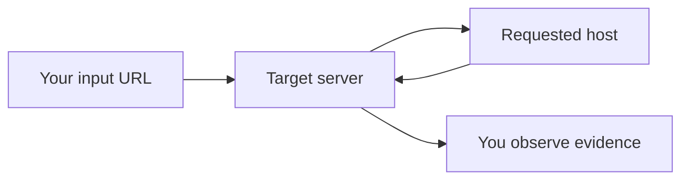

# SSRF — Server-Side Request Forgery (testing notes)

SSRF is when a server makes a network request **because you influenced the destination**.  
It’s dangerous because servers often have access to **internal networks** and **cloud metadata**.

## Common SSRF “entry points”

- URL fetchers (image fetch, link preview, PDF generator)
- Webhooks and “callback URLs”
- Importers (RSS, feed readers, git hooks)
- Proxy-like features (diagnostic tools, “test connection” forms)
- File parsers that support remote references (rare but real)

## Safe verification strategy

- Prefer a **controlled callback endpoint** you own and monitor.
- Confirm whether the server actually made the request:
  - direct evidence in response (non-blind SSRF)
  - **inbound logs** on your callback listener (blind SSRF)

## What to test (without “weaponization”)

- **Host controls**: allowlist vs blocklist behavior
- **Redirect handling**: whether redirects are followed
- **DNS behavior**: resolution timing, caching, and rebinding risk
- **Protocol restrictions**: http/https only? any surprises?
- **Egress rules**: can it reach internal ranges? unusual ports?

## Impact categories (how to reason)

- Internal service discovery (port/service mapping)
- Reading internal-only endpoints (admin panels, debug services)
- Cloud metadata exposure (depends on provider and protections)
- Pivoting into other attacks (credential theft, internal RCE)

## Defensive guidance

- Use strict allowlists for destinations (host + scheme + port).
- Resolve DNS and enforce IP allowlists after resolution (block private ranges).
- Don’t follow redirects automatically (or re-validate each hop).
- Timeouts, size limits, and egress firewall rules.
