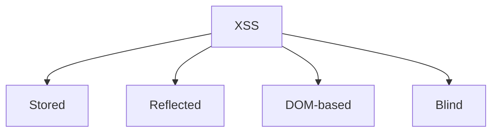

# Cross-Site Scripting (XSS) — testing notes

XSS is when attacker-controlled content ends up executing as JavaScript in a victim’s browser.  
It’s primarily an **output encoding problem** (plus a bit of browser behavior).

> ✅ Keep PoCs harmless (e.g., showing a visible UI change) and test only with permission.

## Types (mental model)

- **Stored**: the input is saved (DB/logs) and later rendered to others.
- **Reflected**: the input comes back immediately in the response.
- **DOM-based**: JS on the page transforms input into HTML/JS dangerously.
- **Blind**: it triggers in someone else’s context (admin panel, log viewer).

## Where to look first

- Comment/review/profile fields
- Search pages and error pages
- Markdown/HTML renderers, “preview” features
- File name rendering, import/export previews
- Admin consoles that show logs, tickets, messages

## Verification approach (safe)

1. Identify **where the input lands** (HTML text, attribute, URL, JS string, template).
2. Confirm whether the application applies **contextual output encoding**.
3. Check whether a **CSP** is present and how strict it is.
4. Confirm impact:
   - session exposure depends on HttpOnly/SameSite
   - account actions depend on CSRF protections and permissions

## Good reporting signals

- Exact sink: `innerHTML`, `document.write`, unsafe templating, attribute injection, etc.
- Browser + page where it triggers.
- A minimal PoC that proves execution without harming users.

## Defensive fixes

- Context-aware output encoding (HTML/attr/URL/JS contexts differ).
- Avoid dangerous sinks; prefer safe DOM APIs.
- Strong CSP (nonce-based), and avoid inline JS.
- Sanitize rich text with a proven library and strict allowlist.
